# Introduction

## My Note

Welcome to the documentation :) and thank you for checking out Media Journal! I won't repeat the readme description, but I will mention the main points again: I love this app, I will maintain it forever, it will always be completely free and it makes me happy if even one person enjoys it alongside me.

It's not the most advanced app, nor am I a senior developer, but I care about this app and I use it daily. I think that's worth something and that's why I got this far with it.

Maybe a senior developer who is nonchalant about their app would have been better, BUT if you are one of the few unlucky people who are looking for an app exactly like this, now you are stuck with me! >:) See ya in the trenches.

## (Old) Demo Video

<iframe width="100%" height="450" src="https://www.youtube.com/embed/JXOvpvdVZpY" title="Media Journal Demo" frameborder="0" allow="accelerometer; autoplay; clipboard-write; encrypted-media; gyroscope; picture-in-picture; web-share" allowfullscreen style="border-radius: 8px;"></iframe>

## Screenshots

*(Click the tabs below to view different pages of the app)*

=== "Home"
    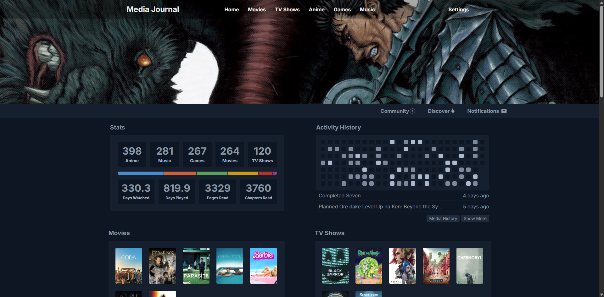

=== "Lists"
    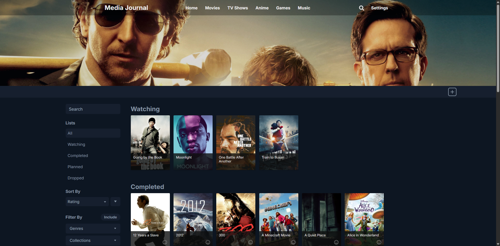

=== "Edit"
    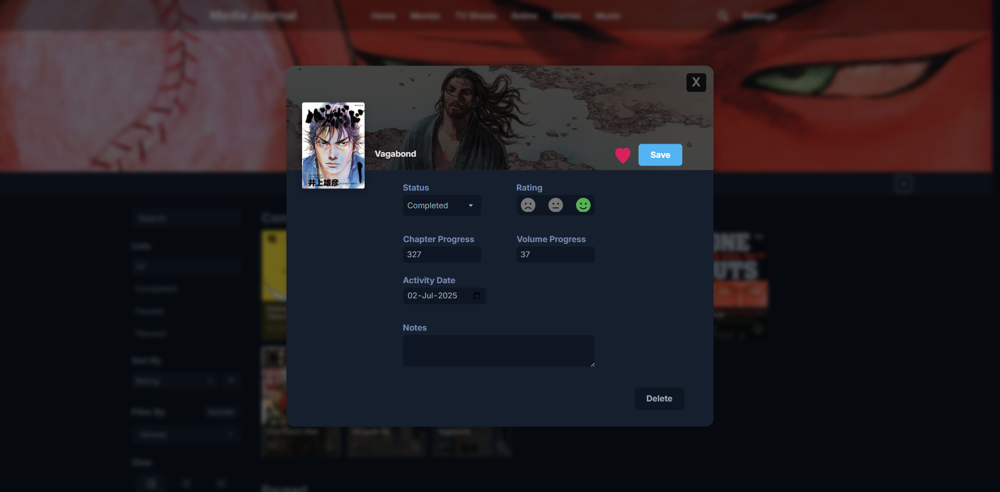

=== "Details"
    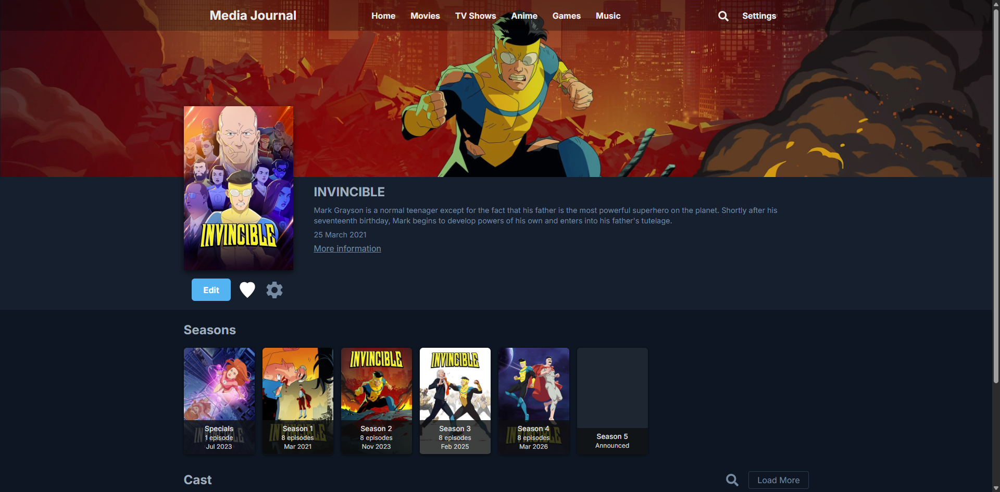

=== "Discover"
    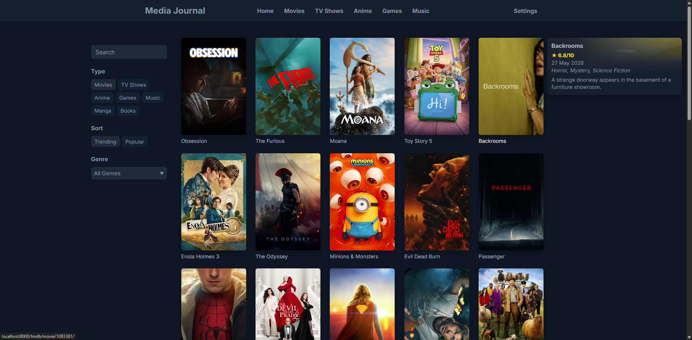

=== "Favorites"
    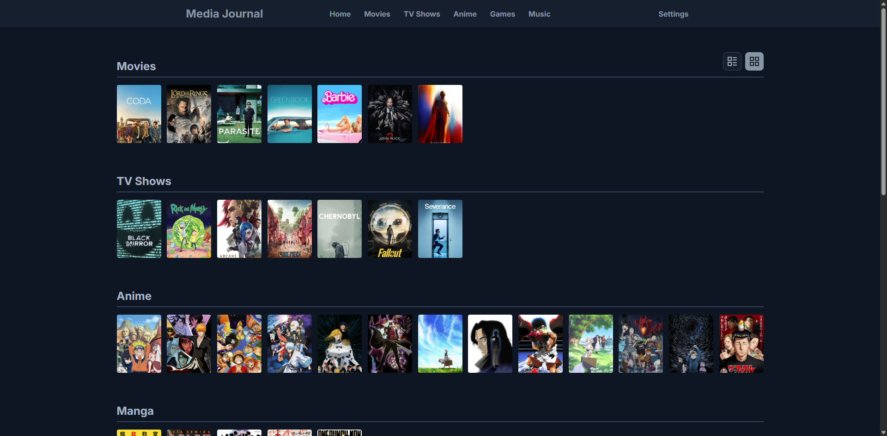

=== "History"
    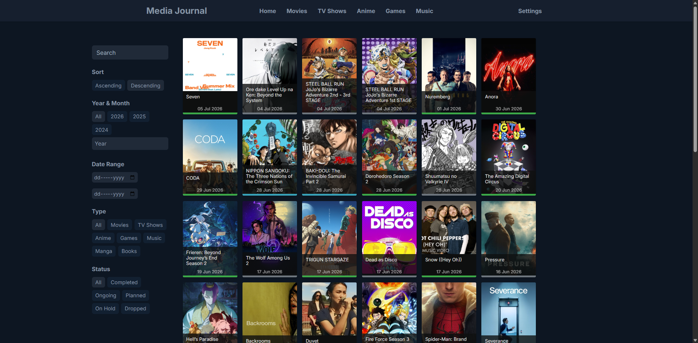

=== "Calendar"
    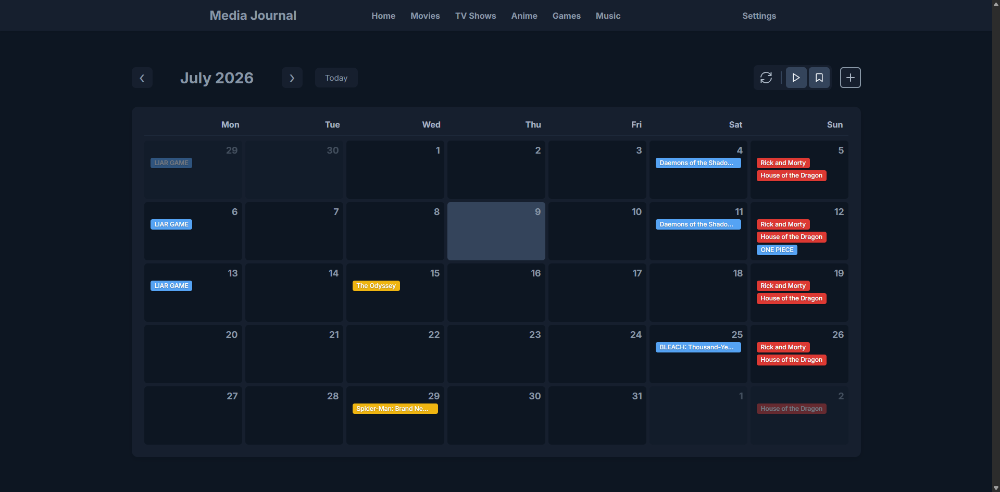

=== "Collections"
    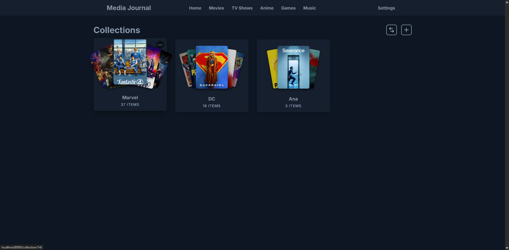

=== "Community"
    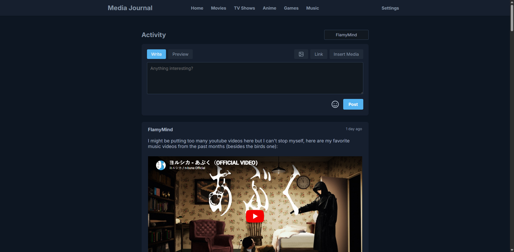

=== "Settings"
    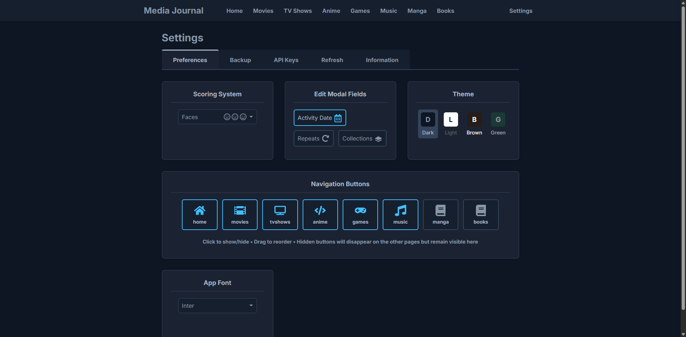

---

## How do I set it up?

[Go to the Setup Guides](setup/docker.md){ .md-button .md-button--primary }

